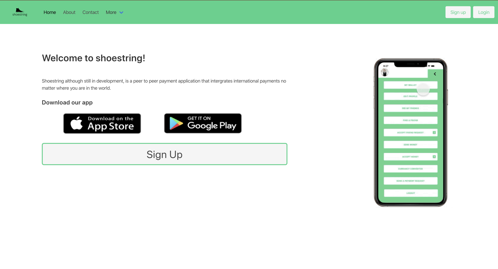
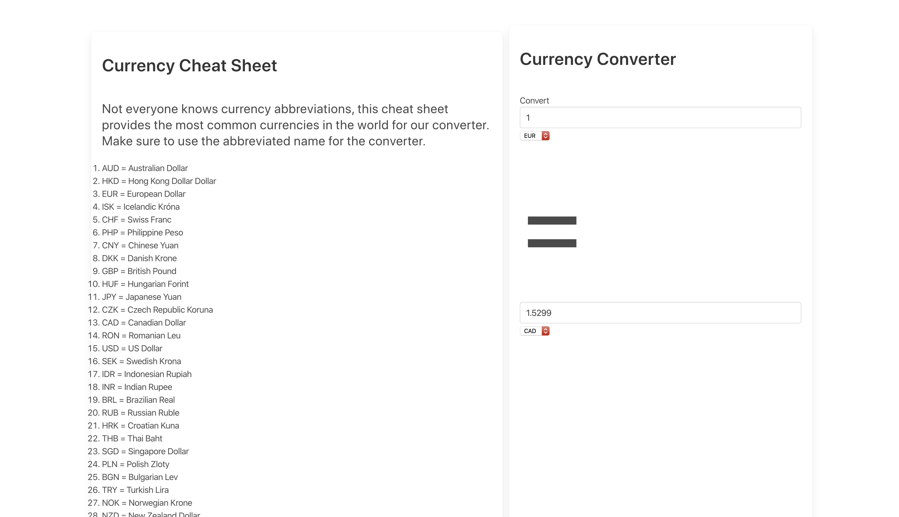
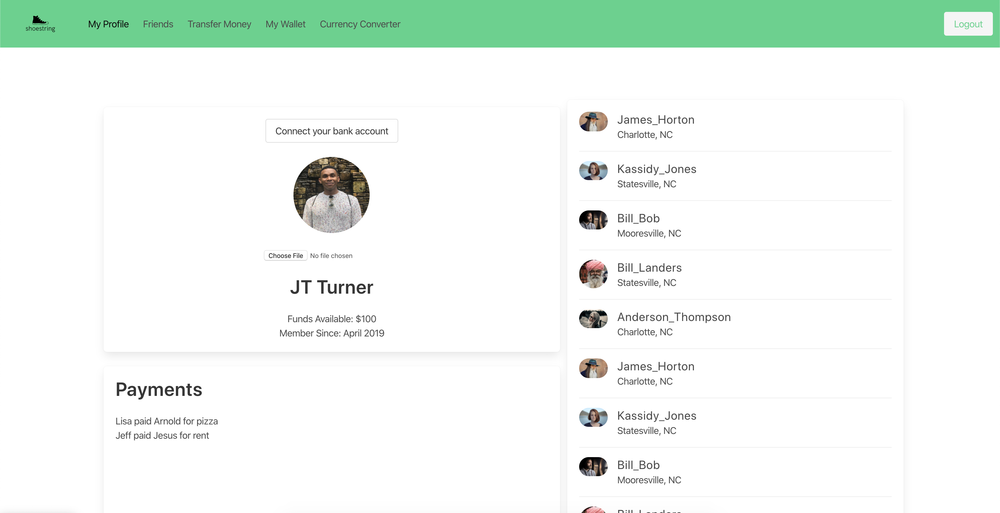

# Shoestring
Shoestring although still in development, is a peer to peer payment application that intergrates international payments no matter where you are in the world.

## Installation
No installation required. Simply visit [Shoestring] (https://www.shoestring.me) and get started!

## Functionality
Shoestring first allows the user to sign up or log in if they already have an account, you will then be routed to your profile page where you can upload a photo, link your bank account and also add friends who you would like to send money too.

## Contributions/Resources
* Group Members: [Cory Marshman] (https://github.com/cmarshman), [Sile Kiman] (https://github.com/Sile-Kiman), [DeVante Bailey ] (https://github.com/DrBailey13), and [JT Turner] (https://github.com/javierturner)

* Other Contributors: UNCC TAs, Students and Instructors

* API/Framework Resources: 
  - [Cloudinary API] (https://cloudinary.com/documentation/image_upload_api_reference)
  - [Bulma Framework] (https://bulma.io/documentation/)
  - [Plaid API] (https://www.plaid.com/docs/)

## Links
    * Deployed Application: https://www.shoestring.me
    * Github Pages: https://github.com/cmarshman/shoestring

## Images
Login Page +++++++++++++++++++++++++++++++++++++

## License
MIT License

Copyright (c) [2020] [Cory_Marshman/Sile_Kiman/DeVante_Bailey/JT_Turner]

Permission is hereby granted, free of charge, to any person obtaining a copy of this software and associated documentation files (the "Software"),to deal in the Software without restriction, including without limitation the rights to use, copy, modify, merge, publish, distribute, sublicense, and/or sell copies of the Software, and to permit persons to whom the Software is furnished to do so, subject to the following conditions: The above copyright notice and this permission notice shall be included in all copies or substantial portions of the Software.

THE SOFTWARE IS PROVIDED "AS IS", WITHOUT WARRANTY OF ANY KIND, EXPRESS OR IMPLIED, INCLUDING BUT NOT LIMITED TO THE WARRANTIES OF MERCHANTABILITY, FITNESS FOR A PARTICULAR PURPOSE AND NONINFRINGEMENT. IN NO EVENT SHALL THE AUTHORS OR COPYRIGHT HOLDERS BE LIABLE FOR ANY CLAIM, DAMAGES OR OTHER LIABILITY, WHETHER IN AN ACTION OF CONTRACT, TORT OR OTHERWISE, ARISING FROM, OUT OF OR IN CONNECTION WITH THE SOFTWARE OR THE USE OR OTHER DEALINGS IN THE SOFTWARE.
